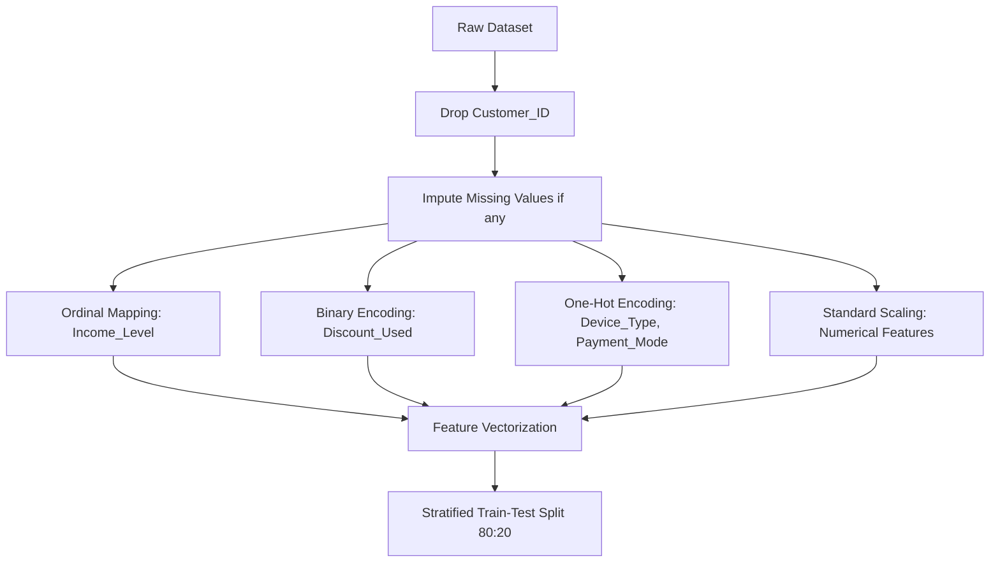

# Data Preprocessing Plan

This document outlines the pipeline designed to prepare the customer subscription dataset (15,946 records) for binary classification training.

## 1. Feature Analysis
The dataset contains 14 features, classified as follows:

| Attribute | Data Type | Preprocessing Action |
| :--- | :--- | :--- |
| `Customer_ID` | Categorical/ID | Drop (non-predictive identifier) |
| `Age` | Numeric | Scale (Standardizer) |
| `Income_Level` | Categorical (Ordinal) | Map (`Low` -> 1, `Medium` -> 2, `High` -> 3) |
| `Number_of_Subscriptions` | Numeric | Pass-through or Scale |
| `Tenure_Months` | Numeric | Scale (Standardizer) |
| `Monthly_Total_Spend` | Numeric | Scale (Standardizer) |
| `Avg_Usage_Hours_Per_Week` | Numeric | Scale (Standardizer) |
| `App_Switch_Frequency` | Numeric | Scale (Standardizer) |
| `Customer_Support_Interactions`| Numeric | Scale (Standardizer) |
| `Satisfaction_Score` | Numeric | Pass-through (1 to 5 index) |
| `Discount_Used` | Categorical (Binary) | Encode (0 = No, 1 = Yes) |
| `Device_Type` | Categorical (Nominal) | One-Hot Encoding (`Mobile`, `Laptop`, `Smart TV`, etc.) |
| `Payment_Mode` | Categorical (Nominal) | One-Hot Encoding (`Credit Card`, `UPI`, `Net Banking`, etc.) |
| `Will_Cancel_Next_3_Months` | Binary Target | Target Label (0 or 1) |

## 2. Pipeline Execution Steps

### Step 2.1: Missing Value Imputation
Although the initial dataset contains no missing values, the production pipeline will implement fallbacks:
* **Numeric Features**: Median Imputer to handle outliers robustly.
* **Categorical Features**: Most Frequent Imputer.

### Step 2.2: Scaling & Encoding
* **Numerical Features**: `StandardScaler` from Scikit-Learn will center feature values around a mean of 0 with unit variance:
  $$x' = \frac{x - \mu}{\sigma}$$
* **Nominal Features**: `OneHotEncoder(drop='first', handle_unknown='ignore')` to convert categories into binary flags without multicollinearity issues.

### Step 2.3: Splitting
* **Split Ratio**: 80% training set, 20% validation/testing set.
* **Methodology**: `train_test_split` with `stratify=y` to preserve the churn-to-non-churn class distribution in both splits.
